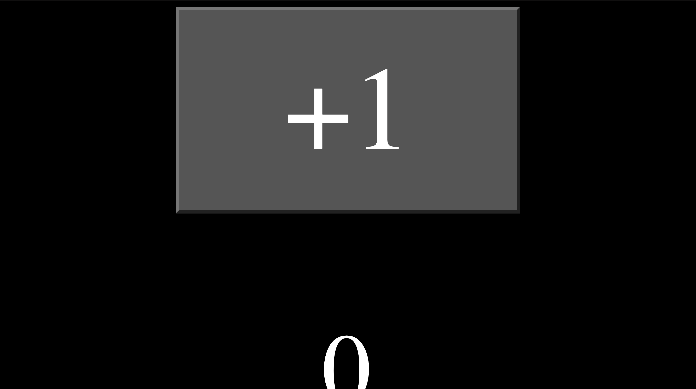

## Rust Front End

My first attempt at using yew to build a front end.

## Notes

Similar to a react app, yew has a JSX similar syntax and makes use of state hooks.

## Current Look

### Running the App

Use `trunk serve ` to run the app :))
